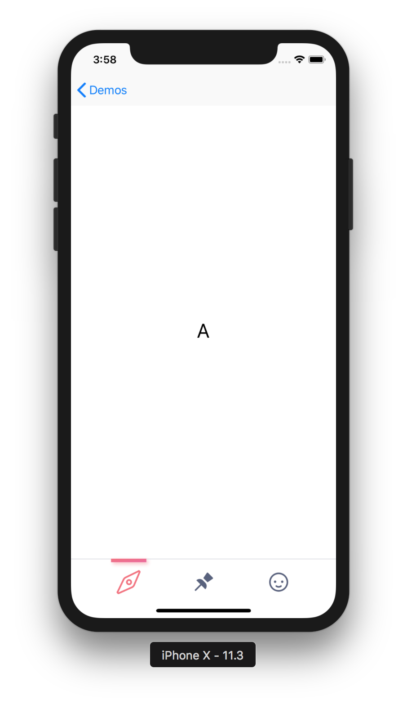

# Portland Rose


## Introduction

Portland Rose, named for the **[portland class](https://en.wikipedia.org/wiki/Garden_roses#Portland)** of rose, is the native iOS app for Compass Rose.

## Xcode Project Structure

```
.
|-- App
|   |-- Controllers
|   |-- Helpers
|   |-- Models
|   |-- Views
|   |   |-- LaunchScreen.storyboard
|   |-- AppDelegate.h
|   |-- AppDelegate.m
|   |-- Assets.xcassets
|   |-- Main.storyboard
|-- demo
|   |-- Models
|   |-- Views
|   |-- DemosViewController.h
|   |-- DemosViewController.m
|   |-- Demo.storyboard
|-- Config
|   |-- Info.plist
```

### App

`App` organizes Portland Rose's applicaiton components. 

* **Controllers** — The `Controllers` subdirectory contains the application's `ViewController`s.
* **Helpers** — The `Helpers` subdirectory contains Objective-C category source files and other helper classes used to assist the application's model, view, and controller classes.
* **Models** — The `Models` subdirectory contains the application's model classes.
* **Views** — The `views` subdirectory contains the application's view classes and `.xib` nib files.

### Demo

`Demo` contains view controllers and other components used to demo application components outside of the context of the app itself.

* **Views** — The `Views` subdirectory contains view controller classes designed to demo specific view classes.
* **Models** — The `Models` subdirectory contains view controller classes designed to demo model classes.
* **DemosViewController.m** and **DemosViewController.h** — These are the source files for the demo index scene.
* **Demo.storyboard** — `Demo.storyboard` is the interface builder for demo view controllers.

### Config

`Config` contains app configuration and build files, such as `info.plist`.

# Views

## TabBarView

`TabBarView` renders a custom tab bar control that can be used with a `UITabBarController`. 



### Usage

1. in the storyboard, drag a `UIView` onto the bar above a tab bar controller scene.
  
2. Set the `UIView`'s class to `TabBarView`.
3. Create reference outlets in the tab bar controller `.m` file for this `TabBarView` *as well as* for the built-in `UITabBar` .
4. In the tab bar controller's `viewDidLoad` method, add the `TabBarView` as a subview.
  ```
  - (void) viewDidLoad {
    // ...
   [self.view addSubview: customTabBarView];
  }
  ```
5. In the tab bar controller's `viewDidLayoutSubviews` method, set the `TabBarView`'s frame equal to the `UITabBar`'s frame.
  ```
  - (void) viewDidLayoutSubviews { 
    // ...
    [self.customTabBarView setFrame: self.systemTabBarView.frame];
  } 
  ``` 
6. In the storyboard, set the `UITabBar`'s `Hidden` property to `YES`.
7. drag the `TabBarView`'s "Value Changed" event to an action outlet in the tab bar controller. There, set the tab bar controller's `selectedIndex` property to equal the `TabBarView`'s `selectedIndex` property. 
  ```
  - (IBAction) handleTabBarSelectedIndexChange: (TabBarView *) tabBarView  {
    self.selectedIndex = tabBarView.selectedIndex;
  }
  ```
 
### Customization

**Changing A Button Image**

1. Add a new icon image to `Assets.xcassets`. It must be 100px in size and have an `@2x` suffix.
2. In `TabBarView.xib`, change the image of the corresponding button

**Adding A Button**

1. In `TabBarView.xib`, copy and paste one of the button views; *This ensures that the necessary constraints are copied as well.* 
2. Follow the steps above for changing the new button's image.
