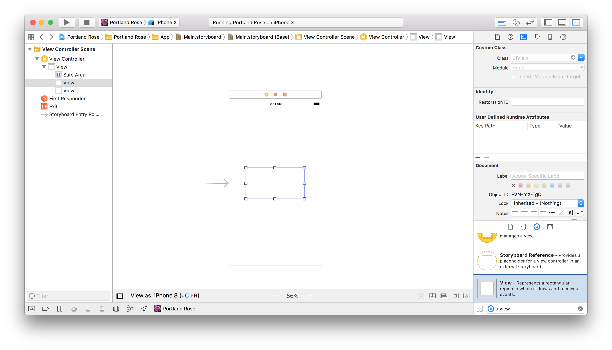
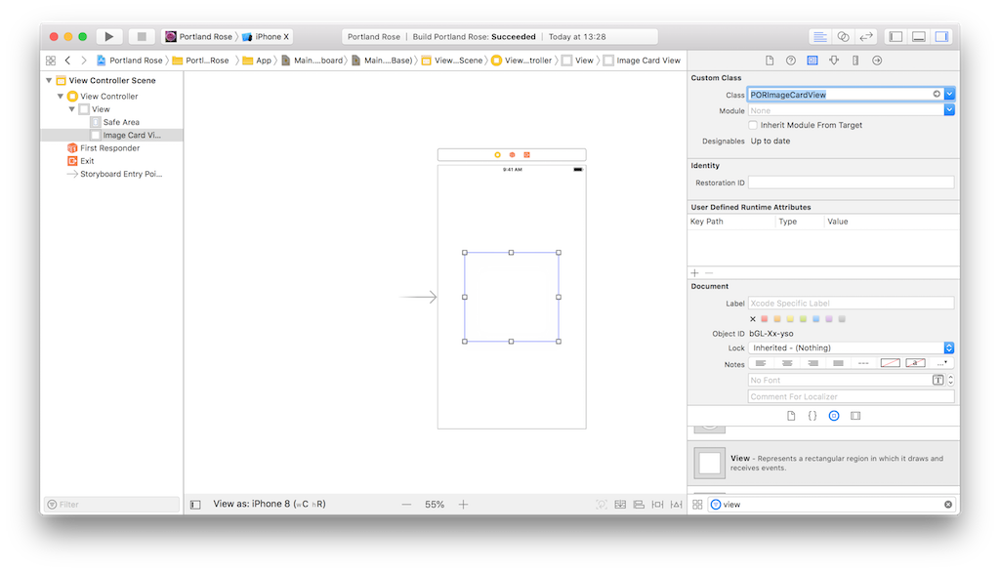
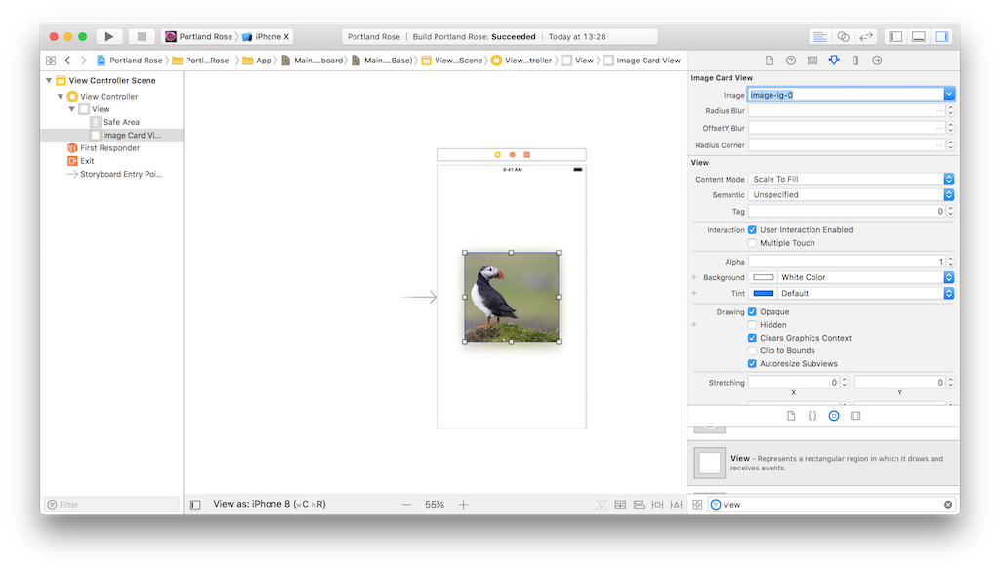
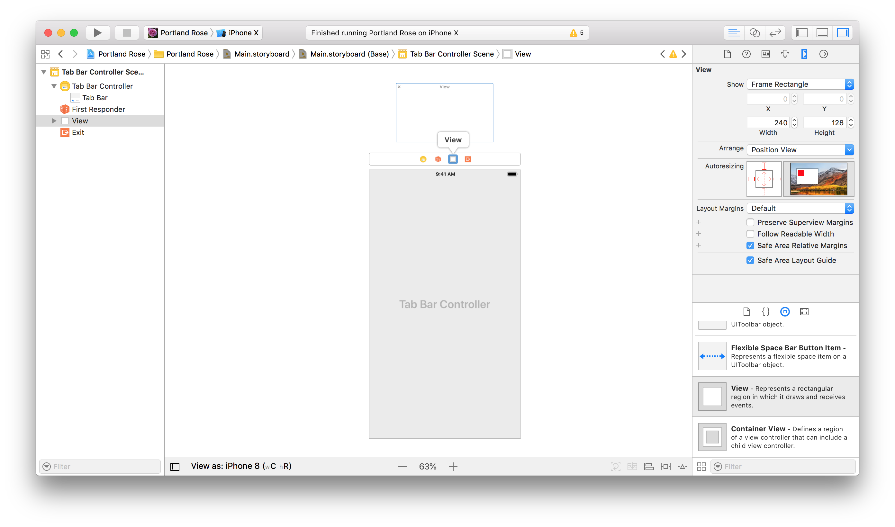

<!-- 
  vim:textwidth=72:bk
-->

# Portland Rose Docs

## Table of Contents

* **[Xcode Project Structure](#xcode-project-structure)**
* **[Build Configurations](#build-configurations)**
* **[Helpers](#helpers)**
* **[Models](#models)**
* **[Views](#views)**


## Xcode Project Structure

```
.
|-- App
|   |-- Controllers
|   |-- Helpers
|   |-- Models
|   |-- Views
|   |   |-- LaunchScreen.storyboard
|   |-- AppDelegate.h
|   |-- AppDelegate.m
|   |-- Assets.xcassets
|   |-- Main.storyboard
|-- Demo
|   |-- Demo Controllers
|   |   |-- Model Demos
|   |   |-- View Demos
|   |   |-- PORDemosViewController.h
|   |   |-- PORDemosViewController.m
|   |-- Helpers  
|   |-- Mocks
|   |-- Models
|   |-- Demo.storyboard
|-- Config
|   |-- Info.plist
```

### App

`App` organizes Portland Rose's applicaiton components. 

* **Controllers** — The `Controllers` subdirectory contains the 
  application's `ViewController`s.
* **Helpers** — The `Helpers` subdirectory contains Objective-C
  category source files and other helper classes used to assist the 
  application's model, view, and controller classes.
* **Models** — The `Models` subdirectory contains the application's 
  model classes.
* **Views** — The `views` subdirectory contains the application's view 
  classes and `.xib` nib files.

### Demo

`Demo` contains view controllers and other components used to demo 
application components outside of the context of the app itself.

* **Demo Controllers** — the `Demo Controllers` subdirectory contains 
  view controllers for demo scenes. These controllers are organized into
  `Model Demos` and `View Demos`. The root demo view controllers are
  `PORDemosViewController.m` and `PORDemosViewController.h`.
* **Helpers** - the `Helpers` subdirectory contains helper classes used
  for testing purposes
* **Mocks** - The `Mocks` subdirectory contains categories used to 
  generate randomized instances of models for testing purposes
* **Models** — The `Models` subdirectory contains models used by demo
  view controllers that are not used by the main application.
* **Demo.storyboard** — `Demo.storyboard` is the interface builder for 
  demo view controllers.

### Config

`Config` contains app configuration and build files, such as 
`info.plist`.

## Build Configurations

### Preprocessor Macros

* **Demo** — the `DEMO` preprocessor macro indicates whether or not the 
  app should run in "Demo" mode. In "Demo" mode, `Demo.storyboard` is 
  the root storyboard.

### Schemes

Portland Rose can be built using one of four different "schemes": 
Demo, Development, Staging, and Production. 

* **Demo** — this scheme is used for building and testing  
  individual application components.  The app will use `Demo.storyboard`
  instead of `Main.storyboard`. The `DEMO` preprocessor macro is set to
  `1`.
* **Development** — this scheme is for integration work. A.P.I. 
  requests will return mock objects.
* **Staging** — this scheme is for testing integration work.  A.P.I.
  requests are directed to a staging endpoint.
* **Production** — this scheme is used to create release-ready 
  archives for distribution on the app store. 

## Helpers

### Palette

The `PORPalette` model stores Portland Rose's custom colors. These 
colors are organized by function (e.g. color for dividers) rather than 
by visual color (e.g. "red"). 

* **Background Color** — `colorBackground` contains the default 
  background color used for the app's scenes and content views.
* **Divider Color** — `colorDivider` is the default color for the 
  thin divider lines between views.
* **Primary Color** — `colorPrimary` is the primary theme color for
  'branded' elements and prominent controls.
* **Secondary Color** — `colorSecondary` is a variant of `colorPrimary` 
  used along with the former in gradients.
* **Text Color** — `colorText` is the default color of application 
  text.
* **Text Color (Inverted)** — `colorTextInverted` is the default 
  color for text displayed on a dark color background.
* **Text Color (Loud)** — `colorTextLoud` is the default color for 
  emphasized text.
* **Text Color (Muted)** — `colorTextMuted` is the default color for 
  subtle text.

#### Usage

1. Import `"PORPalette.h"`
2. create a pointer to the shared `PORPalette` singleton: 
  ```objective-c
  PORPalette * palette = PORPalette.sharedPalette;
  ```
3. Access the palette's colors like this: 
  ```objective-c
  UIColor * color = palette.colorText;
  ```

#### Customization

**Adding New Colors**

To add a new color by hex value and update one or more of the palette's
color properties to use that new color:

1. Add the new color's hex value as a `static NSString *` in `PORPalette.m`
```objective-c                                     
// PORPalette.m                                    
static NSString * const HEX_NEW_COLOR = @"EAEAEA"; 
```                                                
2. Update the `init` function to set one or more of the palette's color
   properties equal to the new color:
```objective-c                                                
- (id) init {                                                 
  if (self = [super init]){                                   
    // ...                                                    
    _colorText = [UIColor colorWithHexString: HEX_NEW_COLOR]; 
  }                                                           
  return self;                                                
}                                                             
```                                                           

**Adding New Palette Color Properties**

Let's say you want to add a new palette color for all warning text. 
Here's how you would go about it:

1. Update `PORPalette.h` 
```objective-c
// PORPalette.h
// ...
@interface PORPalette : NSObject
// ...
@property UIColor * colorTextWarning;
// ...
```
2. Update `init`:
```objective-c
// PORPalette.m
- (id) init {
  if (self = [super init]){
    // ...
    _colorTextWarning = [UIColor colorWithHexString: HEX_THULIAN_PINK];
  }
  return self;
}
```

### TypeLibrary

The `PORTypeLibrary` model organizes the application's fonts by 
function.

* **Body Font** — `fontBody` is the default font for body text.
* **Headline Font** — `fontHeadline` is the default font for headline 
  text, viz. a title that is placed among body text (cf. the title of a 
  book as it appears on the title page and the title of a chapter as it 
  appears on a page alongside regular text).
* **Subtitle Font** — `fontSubtitle` is the default font for subtitle 
  text, e.g. the author's name on the title page of a book or a "Part 
  One" page.
* **Title Font** — `fontTitle` is the default font for title text, e.g.
  the title of a book as it appears on the title page.

#### Usage

1. Import `"PORTypeLibrary.h"`
2. Create a pointer to the shared `PORTypeLibrary` singleton: 
```objective-c
PORTypeLibrary * typeLibrary = PORTypeLibrary.sharedTypeLibrary;
```
3. Access the the library's fonts like this: 
```objective-c
UIFont * font = typeLibrary.fontBody;
```

## Models

### Activity

* **Amount (Minimum Estimate)** — `costLower` is the minimum estimated 
  price for the activity.
* **Amount (Maximum Estimate)** — `costUpper` is the maximum estimated 
  price for the activity.
* **Duration (Minimum Estimate)** — `durationLower` is lower 
  estimate for the activity's duration.
* **Duration (Maximum Estimate)** — `durationUpper` is the upper 
  estimate for the activity's duration.
* **Icon** – `icon` is an icon used to represent the activity.
* **Location** — `location` is the activity's general location. See 
  `PORLocation` documentation.
* **Notes** — `notes` is string of text containing important notes
  from the itinerary creator (e.g. "Watch for pickpockets!").
* **Recommendations** — `recommendations` recommendations from the 
  creator of the itinerary (e.g. "Try the truffle fries!").
* **Reservation Requirement** — `isReservationRequired` denotes 
  whether or not a reservation is required.
* **Subtitle** — `subtitle` is the activity's description.
* **Title** — `title` is a descriptive title for the activity.
* **What To Wear** — `whatToWear` is a description of recommended
  attire.
* **What To Bring** — `whatToBring` is a description of recommended
  things to bring (e.g. sunblock).

### Badge

Badges provide an at-a-glance summary of an itinerary.

* **Icon** — `icon` is the badge's visual representation.
* **Title** — `title` is the name of the badge.

### Itinerary

`PORItinerary` is a subclass of `PORRecord` (see [record](#record)).

* **Activities** — `activities` is a list of all activities that are a 
  part of this itinerary. See `PORActivity` for more information.
* **Badges** — `badges` is a list of all badges associated with this 
  itinerary. See `PORBadge` for more information.
* **Cost (Lower Estimate)** — `costLower` is the lower estimate for the 
  itinerary's total cost.
* **Cost (Upper Estimate)** — `costUpper` is the upper estimate for the 
  itinerary's total cost. 
* **Duration** — `duration` is the duration estimate for the 
  itinerary *in minutes*.
* **Main Image** — `imageMain` is the primary image associated with the 
  itinerary. 
* **Secondary Images** – `imagesSecondary` is a list of secondary 
  images associated with the itinerary.
* **Title** — `title` is this itinerary's display title. 

### Library

The `PORLibrary` class is a singleton responsible for maintaining the
application's [record books](#record-book).

**Properties**

* **Itineraries Feed** — `itinerariesFeed` is a record book containing
[itineraries](#itinerary) in the user's feed.
* **Itineraries Pinned** — `itinerariesPinned` is a record book
containing itineraries that the user has pinned.

### Location

* **Title** — `title` is the name of the location, e.g. "Puffin Cafe" 
  or "505 College Street".

### Record

The `PORRecord` class is the base class for models that may be stored in
a `PORRecordBook` (and by extension, into the `PORLibrary` singleton).

* **I.D.** — `identifier` is the identifier for the record object.  The
  identifier must be unique among all record objects stored in the same 
  [record book](#record-book)


### Record Book

The `PORRecordBook` class stores [record](#record) objects; it supports
simple insertion, deletion, and listing. 

**Initialization**

`PORRecordBook` uses generic types:

```objective-c
typedef SomePORRecordSublcass ObjectType; 
PORRecordBook<ObjectType *> * recordBook;
``` 

**Record Book Delegate Protocol**

The `PORRecordBookDelegate` protocol defines a delegate method called
whenever the record book is updated.

* **Did Update** – `didUpdateRecordBook:` is called whenevever the
record book is updated.

**Methods**

* **All Records** — `allRecords` returns an array of all
currently-stored records.
* **Create Record** — `createRecord:` stores the given record.
* **Create Records** — `createRecords:` stores the given records.
* **Destroy Record** — `destroyRecordWithIdentifier:` removes the
record with the given `identifier`.

**Properties**

* **Delegate** — `delegate` is informed of all record book updates.


## Views

### ActionButtonView

`PORActionButtonView` renders a text button with a colored background 
and drop shadow.

#### Usage

1. First, drag a `UIView` to the interface builder.
   
2. set the view's *position* constraints (do not set size constraints, 
   as `PORActionButtonView` uses intrinsic size).
3. Set the view's class to `PORActionButtonView`.
4. To handle user taps, create an outlet for the "Touch Up Inside" 
   event

#### Customization


`PORActionButtonView` can be customized programmatically or via the 
interface builder.

* **Background Color One** — `colorBackgroundOne` sets the first 
  background gradient color
* **Background Color Two** — `colorbackgroundTwo` sets the second 
  background gradient color
* **Label Color** — `colorLabel` sets the color of the button's label
* **Text** — `text` sets the button's label text

### ActivityCellView

`PORActivityCellView` displays an activity outline.

#### Usage

1. Ensure the parent `UITAbleView` has automatic cell sizing enabled. 
   For better performance, also ensure that its row height estimate is 
   ~300.
2. Update the `UITableView`'s data source methods. In the below 
   example, `_activities` is an `NSArray <PORActivity *> *`.:
```objective-c
- (UITableViewCell *) tableView:(UITableView *)tableView cellForRowAtIndexPath:(NSIndexPath *)indexPath{
  UITableViewCell * cell;
 
  // Dequeue a reusable cell 
  cell = [tableView dequeueReusableCellWithIdentifier:[PORActivityCellView reuseIdentifier]];
  // if necessary, register the nib and try to dequeue again 
  if (!cell){
    [tableView registerNib:[UINib nibWithNibName: [PORActivityCellView nibName] bundle: nil] forCellReuseIdentifier:[PORActivityCellView reuseIdentifier]];
    cell = [tableView dequeueReusableCellWithIdentifier:[PORActivityCellView reuseIdentifier]];
  }
  // configure the cell by setting its `activity` property
  [((PORActivityCellView *) cell) setActivity: _activities[indexPath.row]];

  return cell;
}
```

### Empty State View

`POREmptyStateView` renders an empty state view.  The most common
applications for an empty state are:

* First use (when a collection is empty by default)
* When a user clears a collection
* Error populating collection items

`POREmptyStateView` displays a short header / subheader to describe why
the user is seeing the view.  If the user can perform an action (e.g.
"Try Again" on an empty state view displayed on a network error), a
`POREmptyStateView` can be configured to display an action button and
respond to taps on it.

#### Usage

**Properties**

* **Actionable** — `actionable` indicates whether or not the user can
  perform an action.  If `actionable` is `YES`, a button will be
  added to the view. 
* **Button Text** — `textButton` determines the text to display on the
  view's action button.
* **Header** — `header` is the header text to display.
* **Subheader** — `subhead` is the subheader text to display.

**Handling Events**

To handle user taps on the action button, implement the
`POREmptyStateViewDelegate` protocol:

```objective-c
- (void)didSelectEmptyStateView:(POREmptyStateView *)emptyStateView{
  NSLog(@"Hello, Puffins!");
}
```

### Floating Action Button View

`PORFloatingActionButtonView` renders a button with an icon image and a 
1:1 aspect ratio.

#### Usage

`PORFloatingActionButtonView` can be customized programmatically or 
via the interface builder.

* **Background Color One** — `colorBackgroundOne` sets the first 
  background gradient color
* **Background Color Two** — `colorbackgroundTwo` sets the second 
  background gradient color
* **Label Color** — `colorLabel` sets the color of the button's label
* **Tint Color** — `colorTint` sets the tint color of the button's 
  image
* **Image** — `image` is the image to be displayed.
* **Radius** — `radius` sets the button's intrinsic size

### ImageCardView

`PORImageCardView` displays a single image on an attractive card. 

#### Usage

1. First, create a `UIview` instance either in a `.xib` file or in
   a storyboard interface builder.
2. Select the `UIView` instance and Set the `UIView`'s class to 
   `PORImageCardView` in the Identity Inspector 
   
3. Set the `PORImageCardView`'s "Image" property in the Attributesi
   Inspector, or set the image at runtime by creating a reference
   outlet for the `PORImageCardView` instance and calling 
   `setImage:`
   

#### Customization

`PORImageCardView` can be customized either programmatically or 
via the interface builder. `PORImageCardView` can be customized in 
these ways:

* **Blur Radius** — `setRadiusBlur:` sets the image card's shadow
  radius
* **Blur Offset (Y)** — `setOffsetYBlur:` sets the vertical offset of 
  the image card's shadow 
* **Corner Radius** — `setRadiusCorner:` sets the image card's corner 
  radius


### ImageCarouselView

`PORImageCarouselView` renders a horizontal carousel containing image 
cards (see `PORImageCardView`). 

#### Usage

1. Add a `UIView` to the interface builder and set its class to 
  `PORImageCarouselView`.
2. Create a reference outlet for it.
```objective-c
@property (weak, nonatomic) IBOutlet PORImageCarouselView *carousel;
```
3. set the carousel's images: 
```objective-c
// ExampleViewController.m
// ...
- (void) viewDidLoad{
  [super viewDidLoad];
  NSArray <UIImage *> * images = @[[UIImage imageNamed: @"example-image"]];
  [_carousel setImages: images];
}
```
4. When a user changes the current image displayed in the carousel,
  the carousel notifies its delegate using the 
  `imageCarouselView:didChangeIndex:` protocol method. To handle this,
  first ensure that the parent view or view controller conforms to the 
  `PORImageCarouselViewDelegate` protocol:
```objective-c
// ExampleViewController.h
// ...
@interface ExampleViewController : UIViewController <PORImageCarouselDelegate> 
// ...
```
```objective-c
// ExampleViewController.m
// ...
- (void) imageCarouselView: (PORImageCarouselView *) carouselView didChangeIndex: (NSUInteger) index{
  NSLog(@"%lu", index);
}
// ...
``` 
Next, set the `PORImageCarouselView`'s `delegate` property:
```objective-c
// ExampleViewController.m
// ...
- (void) viewDidLoad {
  [super viewDidLoad];
  [_carousel setDelegate: self];
  // ...
}
```

### ItineraryHeaderCellView

The `PORItineraryHeaderCellView` class displays an itinerary title 
along with cost / duration estimates and a carousel of itinerary 
images.

#### Usage

1. Configure the parent table view or table view controller's 
  `cellForRowAtIndexPath:` method:
```objective-c
- (UITableViewCell *)tableView:(UITableView *)tableView cellForRowAtIndexPath:(NSIndexPath *)indexPath{
  UITableViewCell * cell;
  
  // Try to dequeue the cell without registering a nib / reuse id 
  cell = [tableView dequeueReusableCellWithIdentifier: [PORItineraryHeaderCellView reuseIdentifier]];
  // If that fails, register the nib / reuse id and try again
  if (!cell){
    [tableView registerNib:[UINib nibWithNibName:[PORItineraryHeaderCellView nibName] bundle:nil] forCellReuseIdentifier:[PORItineraryHeaderCellView reuseIdentifier]];
    cell = [tableView dequeueReusableCellWithIdentifier: [PORItineraryHeaderCellView reuseIdentifier]];
  }
  // Set the cell's `_itinerary` property 
  [((PORItineraryHeaderCellView *) cell) setItinerary: _itineraries[indexPath.row]];
  
  return cell;
}
```

### LabeledIconView

The `PORLabeledIconView` displays a horizontal stack containing a 
single image icon and a text label.

#### Usage

A `PORLabeledIconView` can be added directly to the interface builder 
by adding a `UIView` and setting its class to `PORLabeledIconView`.

* **Icon** — `icon` sets the icon.
* **Text** — `text` sets the label's text. *Note: If `text` is not 
given, or if it contains only whitespace characters, the 
`PORLabeledIconView` will not be displayed at all (`hidden == YES`)*.

#### Customization

The `PORLabeledIconView` class can be customized in these ways:

* **Color** — `color` sets the text color and icon tint color. `color` 
  defaults to the `PORPalette`'s default text color.
* **Font** — `font` sets the label's font; it defaults to 
  `PORTypeLibrary`'s default body font.
* **Stack Spacing** – `spacingStack` sets the spacing between the 
  icon and its label.


### NavigationController

The `PORNavigationController` class renders a customized navigation bar.

#### Usage

In the interface builder, set the navigation controller's class to 
`PORNavigationController`; all child view controllers will display the customized navigation bar.

### TabBarView

`PORTabBarView` renders a custom tab bar control that can be used with 
a `UITabBarController`. 

#### Usage

1. In the storyboard, drag a `UIView` onto the bar above a tab bar 
   controller scene.
  
2. Set the `UIView`'s class to `PORTabBarView`.
3. Create reference outlets in the tab bar controller `.m` file for 
   this `PORTabBarView` *as well as* for the built-in `UITabBar` .
4. In the tab bar controller's `viewDidLoad` method, add the 
  `PORTabBarView` as a subview.
```objective-c
- (void) viewDidLoad {
  // ...
 [self.view addSubview: customTabBarView];
}
```
5. In the tab bar controller's `viewDidLayoutSubviews` method, set the `PORTabBarView`'s frame equal to the `UITabBar`'s frame.
```objective-c
- (void) viewDidLayoutSubviews { 
  // ...
  [self.customTabBarView setFrame: self.systemTabBarView.frame];
} 
``` 
6. In the storyboard, set the `UITabBar`'s `Hidden` property to `YES`.
7. Drag the `PORTabBarView`'s "Value Changed" event to an action 
   outlet in the tab bar controller. There, set the tab bar 
   controller's `selectedIndex` property to equal the `PORTabBarView`'s 
   `selectedIndex` property. 
```objective-c
- (IBAction) handleTabBarSelectedIndexChange: (PORTabBarView *) tabBarView  {
  self.selectedIndex = tabBarView.selectedIndex;
}
```
 
#### Customization

**Changing A Button Image**

1. Add a new icon image to `Assets.xcassets`. It must be 100px in size
   and have an `@2x` suffix.
2. In `PORTabBarView.xib`, change the image of the corresponding button

**Adding A Button**

1. In `PORTabBarView.xib`, copy and paste one of the button views;
   *this ensures that the necessary constraints are copied as well.* 
2. Follow the steps above for changing the new button's image.

### ItinerarySummaryCellView

`PORItinerarySummaryCellView` is a subclass of `UITableCellView`. 
It is responsible for rendering a single `PORItinerarySummaryView` and
for notifying its delegate of user interactions with the same.

#### Usage

Follow the same steps you would follow to use any other custom 
`UITableCellView` subclass, then:

1. Ensure that the table view uses 
   **[self-sizing table view cells][1]**.
2. Set the table view's `tableView:cellForRowAtIndexPath:` method:
```objective-c
((PORItinerarySummaryCellView *) cell).index = indexPath.row;
``` 
3. Add the `<PORItinerarySummaryCellViewDelegate>` protocol to the 
   table view:
```objective-c
// ExampleTableView.h
@interface @interface ExampleTableView : UITableViewController <PORItinerarySummaryCellViewDelegate>
@end
```
and implement its methods:
```objective-c
// ExampleTableView.m
//...
- (void) didSelectItineraryAtIndex:(NSUInteger)index{
  NSLog(@"Did select itinerary #%lu", (unsigned long) index);
}
//...
```

#### Customization

To customize the cell's `PORItinerarySummaryView` appearance, update 
its parent table view's `tableView:cellForItemAtIndexPath:` method:

```objective-c
PORItinerary * itinerary = [[PORItinerary alloc] init];
PORItinerarySummaryView * isv = ((PorItinerarySummaryCellView *) cell).itinerary = itinerary;
```

### ItinerarySummaryView

The `PORItinerarySummaryView` renders a summary of a date itinerary.

#### Usage

A `PORItinerarySummaryView` can be instantiated either via the 
interface builder or programmatically.

#### Customization

These attributes may be customized:

* **Cost (Lower Bound)** — `costLower` is the lower bound of the 
  itinerary's total cost estimate
* **cost (upper bound)** — `costUpper` is the upper bound of the 
  itinerary's total cost estimate
* **Duration** — `curation` is the estimated itinerary duration 
  *in minutes*.
* **Icons** — `icons` is an array of icon images to display
* **Image** — `image` is the itinerary's primary image
* **Title** — `title` is the itinerary title


[1]: https://developer.apple.com/library/content/documentation/UserExperience/Conceptual/AutolayoutPG/WorkingwithSelf-SizingTableViewCells.html
